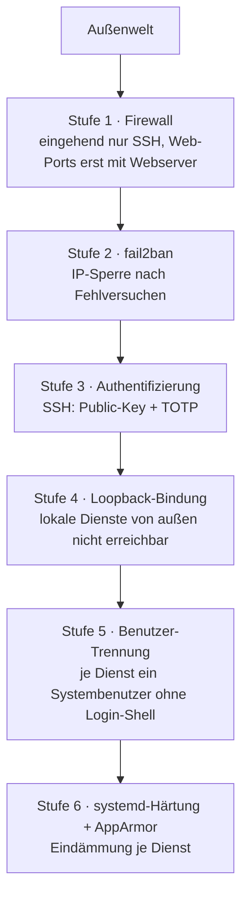

# Härtung

Dieses Dokument legt die Sicherheitsanforderungen an das gehärtete Linux-Grundsystem fest und beschreibt deren Umsetzung. Es benennt Maßstab und Schutzziele, gegen die die Installationsanleitung geprüft wird, und die Härtungsmaßnahmen im Einzelnen.

**Status:** in Bearbeitung — **Stand:** 2026-06-18

## Inhaltsverzeichnis

1 Maßstab und Geltung
2 Schutzziele und Defense-in-depth
3 Authentifizierung und Zwei-Faktor
4 Minimale Angriffsfläche
5 Brute-Force-Schutz
6 Trennung der Zugangsdaten
7 Dienst-Isolation
8 Härtungsprüfung

## 1. Maßstab und Geltung

Die Härtung folgt dem BSI-IT-Grundschutz als Referenz für die Auswahl der Maßnahmen. Die technische Konfiguration wird mit dem CIS-Benchmark für Ubuntu Server (Level 1) geprüft. Ein benannter Maßstab macht „gehärtet" prüfbar. Der BSI-Grundschutz passt zum deutschen Rechts- und Datenschutz-Kontext. CIS Level 1 liefert die konkrete, testbare Konfigurations-Checkliste, ohne den Betrieb übermäßig einzuschränken. Level 2 wäre für ein universell einsetzbares Grundsystem zu restriktiv.

Der Maßstab ist verbindlicher Soll-Maßstab. Abweichungen je Maßnahme werden begründet und in der Betriebsdokumentation festgehalten.

## 2. Schutzziele und Defense-in-depth

Sicherheitskritischer Zugriff verlangt mehrere unabhängige Schichten. Prüfbar ist das am SSH-Zugang (Public-Key plus TOTP) und an der Erreichbarkeit interner Dienste (nur über Loopback, nicht von außen). Das Schichtenmodell:

## 3. Authentifizierung und Zwei-Faktor

Interaktiver Login erfolgt nicht ohne zweiten Faktor. Für SSH ist das Public-Key plus TOTP über PAM (`pam_google_authenticator.so` aus `libpam-google-authenticator`). Passwort-Authentifizierung und Root-Login per SSH sind abgeschaltet. Der Faktor-Stack läuft über `AuthenticationMethods publickey,keyboard-interactive`, `KbdInteractiveAuthentication yes` und `UsePAM yes`.

Administrative Tätigkeiten laufen über den Wechsel zum Root-Konto per `su`. `sudo` gehört zur Ubuntu-Standardinstallation und bleibt installiert, weil der CIS-Benchmark es erwartet, wird aber nicht genutzt. Der Hauptbenutzer ist kein Mitglied administrativer Gruppen (insbesondere nicht der Gruppe `sudo`). Änderungen an der sudo-Konfiguration überwacht `auditd` (Kapitel 8).

Der SSH-Zugang ist auf eine eigene Gruppe beschränkt (`AllowGroups ssh-users`). Die Konfiguration setzt die gehärteten Soll-Werte (unter anderem `PermitRootLogin no`, `PasswordAuthentication no`, `MaxAuthTries`, `LoginGraceTime`) und ist über `sshd -T` prüfbar.

Jeder SSH-Login löst eine Mail-Benachrichtigung an die Admin-Adresse aus. Die Benachrichtigung läuft über `pam_exec` in `/etc/pam.d/sshd` (Session-Zeile `optional`, Skript als `root` mit Mode 700), nicht über `sshrc`. Nur unter `pam_exec` sind die PAM-Umgebungsvariablen gesetzt und das root-eigene Skript lesbar. `optional` sorgt dafür, dass ein Mail-Fehler den Login nicht blockiert. Sicherheitsrelevante Ereignisse werden persistent in `journald` protokolliert und mindestens drei Monate aufbewahrt (Konzept-Dokument Protokollierung und automatische Updates, Kapitel 1).

## 4. Minimale Angriffsfläche

Eingehend ist im Grundzustand nur SSH offen. Die Web-Ports 80 und 443 öffnen erst mit dem aktiven Webserver, Port 80 nur temporär zur Zertifikatsausstellung. Die Dienste laufen mit minimalen Rechten (Kapitel 7, Dienst-Isolation).

## 5. Brute-Force-Schutz

Wiederholte Fehlversuche lösen eine Sperre aus. Auf Systemebene sperrt `fail2ban` die Quell-IP nach wiederholten SSH-Fehlversuchen (serverweite IP-Sperre). Die Voreinstellungen genügen. Sie werden über eine `jail.local` gegen Überschreiben bei Updates geschützt, das `sshd`-Jail ist in der Standardkonfiguration aktiv.

## 6. Trennung der Zugangsdaten

Zugangsdaten, Token und Schlüssel liegen außerhalb des Repos in Dateien mit Mode 600 oder 640 und werden in der Konfiguration referenziert, nicht eingebettet. Diese Dateien liegen unter dem Konfig-Verzeichnis des jeweiligen Eigentümers.

Diese Stelle legt die maßgebliche Regel für Dateien mit Zugangsdaten fest. Alle Komponenten, die eine solche Datei lesen oder prüfen, beziehen sich auf diese Regel und wiederholen sie nicht abweichend.

Regel für Dateien mit Zugangsdaten (maßgeblich):

- Eine Datei, die nur Root liest, erhält Eigentümer `root:root` und Mode exakt 600.
- Eine Datei, die ein Dienst-Benutzer lesen muss, erhält Eigentümer `root:<dienst-gruppe>` und Mode exakt 640. Mode 640 ist nur in Verbindung mit einer dafür eingerichteten Gruppe zulässig.

Eine Komponente, die eine solche Datei vor der Nutzung prüft, prüft fail-closed und lehnt bei jeder Abweichung ab. Geprüft wird:

- Keine Welt-Rechte: `o-rwx` ist erfüllt, andernfalls Ablehnung. Eine für die Welt lesbare Datei mit Zugangsdaten wird nie genutzt.
- Erwarteter Eigentümer und erwartete Gruppe: `root:root` bei Mode 600, `root:<dienst-gruppe>` bei Mode 640. Eine fremde Gruppe bei Mode 640 wird abgelehnt.
- Erwarteter Mode exakt: 600 für root-only, 640 für dienst-lesbar. Ein abweichender Mode wird abgelehnt.

## 7. Dienst-Isolation

Dienste, die keine root-Rechte benötigen (Postfix, nginx), laufen unter einem eigenen System-Benutzer ohne Login-Shell und mit minimalen Rechten. Die übrigen Grundsystem-Dienste benötigen root und laufen entsprechend privilegiert. Die Loopback-Bindung lokaler Dienste ist die primäre Eindämmung gegen externe Erreichbarkeit.

Über die Benutzer-Trennung hinaus sieht der BSI-Grundschutz Mandatory-Access-Control (AppArmor) oder Isolation per Container/chroot für exponierte Dienste vor. Die Umsetzung ist zweistufig festgelegt. Stufe 1: jede selbst eingerichtete systemd-Unit erhält Hardening-Direktiven (`NoNewPrivileges`, `ProtectSystem=strict`, `PrivateTmp`, `ProtectHome`). Das kostet kein zusätzliches Werkzeug. Stufe 2: die von Ubuntu mitgelieferten AppArmor-Profile laufen im Enforce-Modus und werden im Härtungs-Prüflauf (Kapitel 8) kontrolliert. Für nginx wird ein eigenes Profil ergänzt, weil das Distro-Paket keines mitliefert (Handbuch-Kapitel 13).

## 8. Härtungsprüfung

Der Prüflauf erfolgt mit `lynis` (`lynis audit system`) als Standard-Audit-Werkzeug, ergänzt um den Abgleich mit der CIS-Konfigurations-Checkliste (Ubuntu Server Level 1). Der Lauf wird zeitbasiert automatisiert (cron) und sein Ergebnis abgelegt, sodass ein datierter Prüfnachweis vorliegt.

Der Befund je BSI-Maßnahmenklasse wird mit Schweregrad und Handlungsempfehlung festgehalten. Der Prüflauf erfolgt monatlich. Der datierte Befund ist der Nachweis.

Den laufenden Schadsoftware-Schutz leistet `rkhunter` mit täglichem Lauf aus `cron.daily` und Mail-Bericht an die Admin-Adresse. Die Baseline-Datenbank wird bei der Einrichtung initialisiert (`rkhunter --propupd`). Das Monitoring prüft die Frische des Scan-Logs (Konzept-Dokument Monitoring, Kapitel 1).

## Versionshistorie

| Version | Datum | Wer | Änderung |
|---|---|---|---|
| 0.01 | 2026-06-18 | macodix | Erstanlage durch Zusammenführung der Dokumente Sicherheitsanforderungen und Härtungskonzept. Doppelte Abschnitte (Maßstab, Defense-in-depth, Trennung der Zugangsdaten) vereint. Pauschale Benutzer-Zuordnung in der Dienst-Isolation auf die tatsächliche Rechtelage korrigiert. |
