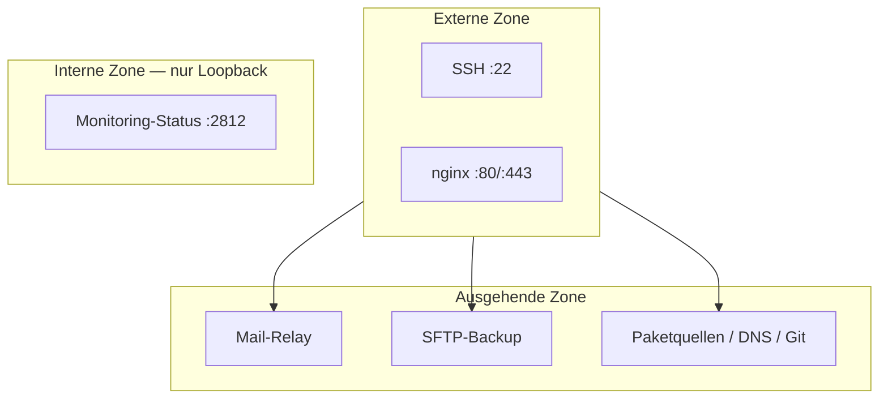

# Systemtopologie

Dieses Dokument beschreibt den Aufbau des gehärteten Linux-Grundsystems auf einem einzelnen Server: Wirt und Betriebssystem, die Zuordnung der Dienste, das Verzeichnis- und Dienst-Layout, die Vertrauenszonen, den Port-Plan und die ausgehende Firewall-Zielliste.

**Status:** in Bearbeitung — **Stand:** 2026-06-18

## Inhaltsverzeichnis

1 Wirt und Betriebssystem
2 Dienste auf dem Wirt
3 Verzeichnis- und Dienst-Layout
4 Vertrauenszonen
5 Port-Plan
6 Ausgehende Firewall-Zielliste

## 1. Wirt und Betriebssystem

Das System läuft auf einem einzelnen Linux-Server mit Ubuntu Server LTS, ohne grafische Oberfläche. Die Laufzeitumgebung ist ein VPS oder eigene Hardware. Sie ist Einsatzkontext, keine Anforderung.

Alle Dienste laufen auf diesem einen Wirt. Es gibt keine Verteilung auf mehrere Server und keine Redundanz.

## 2. Dienste auf dem Wirt

Die Dienste gliedern sich in zwei Gruppen: das gehärtete Grundsystem und den Webserver. Grundsystem-Dienste binden teils an Loopback (Postfix-Submission), teils an keinen Netz-Port (Datensicherung und Monitoring laufen lokal). Nur SSH und der Webserver nehmen Verbindungen von außen an.

| Gruppe | Dienst | Bindung | Benutzer | Auto-Restart |
|---|---|---|---|---|
| Grundsystem | SSH (`sshd`) | extern, Port 22 | root | systemd |
| Grundsystem | Postfix (Satellite) | Loopback | postfix | systemd |
| Grundsystem | Brute-Force-Schutz (`fail2ban`) | kein Port | root | systemd |
| Grundsystem | Firewall (`ufw`/nftables) | kein Port | root | systemd |
| Grundsystem | Monitoring (`monit`) | Loopback (Status) | root | systemd |
| Grundsystem | Datensicherung (`restic` per cron) | kein Port (ausgehend SFTP) | root | cron-Timer |
| Grundsystem | Auto-Update (`unattended-upgrades`) | kein Port | root | apt-daily-Timer |
| Grundsystem | Schadsoftware-Scan (`rkhunter`) | kein Port | root | cron.daily |
| Grundsystem | Log-Bericht (`logwatch`) | kein Port | root | cron.daily |
| Grundsystem | Auditing (`auditd`) | kein Port | root | systemd |
| Webserver | nginx (TLS-Terminierung, statische Auslieferung) | extern, Ports 80/443 | www-data | systemd |

Jeder netzferne Dienst läuft unter einem eigenen System-Benutzer ohne Login-Shell und ohne administrative Gruppenrechte. Alle Dauerdienste starten nach Reboot und nach Absturz automatisch wieder.

Der Webserver ist erst aktiv, wenn nginx installiert ist. Bis dahin nimmt der Server eingehend nur SSH an (Kapitel 5). Aufbau und Begründung des Webservers stehen im Konzept-Dokument nginx-Grundsatz, die Einrichtung im Handbuch-Kapitel 13.

## 3. Verzeichnis- und Dienst-Layout

Das Layout folgt den Unix-Konventionen: Konfiguration unter `/etc`, Laufzeit- und Datenverzeichnisse unter `/var/lib`, System-Skripte unter `/usr/local/sbin`. Es erfüllt die Geheimnis-Trennung (Konzept-Dokument Härtungskonzept, Kapitel 5) und die Auswahl der Backup-Pfade (Konzept-Dokument Datensicherung, Kapitel 1).

| Pfad | Inhalt | Eigentümer/Rechte |
|---|---|---|
| `/root/config/` | Geheimnis-Dateien (restic-Passphrase u. a.) | `root`, 600 |
| `/var/lib/secure-base/` | Erfolgs-Kennzeichen der Datensicherung, Härtungsberichte | `root` |
| `/usr/local/sbin/` | System-Skripte (Backup, Härtungsprüfung) | `root`, 700 |
| `/etc/nginx/sites-available/` | Server-Blöcke des Webservers | `root` |

Geheimnis-Dateien, die nur Root liest, erhalten Mode 600. Muss ein Dienst-Benutzer eine Geheimnis-Datei lesen, erhält sie Mode 640 mit einer dafür eingerichteten Gruppe.

## 4. Vertrauenszonen

Auf einem Einzelserver gibt es keine physischen Netzsegmente. Die Trennung entsteht durch die Bindungs-Adresse der Dienste und die Firewall. Drei Zonen lassen sich unterscheiden.

Die externe Zone umfasst die von außen erreichbaren Anschlüsse: SSH (Port 22) und — bei aktivem Webserver — die Web-Ports 80 und 443. Nur diese Dienste lauschen auf einer öffentlich erreichbaren Adresse.

Die interne Zone umfasst Dienste, die nur lokal erreichbar sind. Sie binden an `127.0.0.1` und sind von außen nicht erreichbar. Im Grundsystem ist das der Status-Endpunkt des Monitorings.

Die ausgehende Zone umfasst die kontrollierten Verbindungen nach außen: zum Mail-Relay, zum SFTP-Backup-Ziel sowie zu Paketquellen, DNS und Git. Die ausgehende Firewall erlaubt nur die benötigten Ziele und Ports (Kapitel 6).

## 5. Port-Plan

Im Grundzustand ist eingehend nur SSH offen. Die Web-Ports 80 und 443 werden erst mit dem Webserver geöffnet, Port 80 nur temporär zur Zertifikatsausstellung und -erneuerung (Konzept-Dokument nginx-Grundsatz). Loopback-Verkehr passiert die Host-Firewall nicht, daher sind lokal gebundene Dienste in der Firewall nicht freigegeben.

| Port | Protokoll | Richtung | Bindung | Zweck | Firewall-Status |
|---|---|---|---|---|---|
| 22 | TCP | eingehend | extern | SSH-Verwaltung | offen (Grundzustand) |
| 80 | TCP | eingehend | extern | ACME-HTTP-01 (TLS-Zertifikat) | nur temporär mit Webserver |
| 443 | TCP | eingehend | extern | HTTPS Webserver | offen mit Webserver |
| 2812 | TCP | lokal | 127.0.0.1 | Monitoring-Status | nicht freigegeben (Loopback) |

Die Soll-Liste der eingehend erlaubten Ports ist Teil der Betriebsdokumentation und wird mit dem Ist-Zustand verglichen (`ss -H -tulpen`, `ufw status verbose`). Jeder lauschende Port ohne Eintrag in der Soll-Liste ist ein Befund.

Auf die optionale Verschärfung, den SSH-Port zusätzlich auf bekannte Quell-Netze zu beschränken, wird bewusst verzichtet. Bei wechselndem Standort des Betreibers führt eine Quell-Netz-Regel zur Selbst-Aussperrung oder wird wirkungslos breit. Der Zugang ist über Public-Key, TOTP und `fail2ban` dreifach gesichert.

## 6. Ausgehende Firewall-Zielliste

Die Firewall ist `ufw` mit Default-Policy `deny` für beide Richtungen. Erlaubt werden nur die für den Betrieb nötigen Ziele. Im Grundzustand sind die Regeln port-, nicht zielhost-gebunden, weil Paketquellen, DNS-Server und Git-Gegenstellen wechselnde Adressen haben. `ufw` legt zu jeder Regel automatisch das IPv6-Pendant an.

| Ziel-Port | Protokoll | Zweck |
|---|---|---|
| 587 | TCP | Mail-Versand an das Relay (Submission/STARTTLS) |
| 53 | TCP/UDP | DNS-Auflösung |
| 80 | TCP | Paketquellen (apt), ACME-Bezug |
| 443 | TCP | Paketquellen, Git |
| 22 | TCP | Git-Push und SFTP-Backup |

Loopback-Verkehr passiert die Host-Firewall nicht, daher brauchen lokal gebundene Dienste keine `ufw`-Regel.

## Versionshistorie

| Version | Datum | Wer | Änderung |
|---|---|---|---|
| 0.01 | 2026-06-18 | macodix | Erstanlage durch bereinigte Übernahme. |
