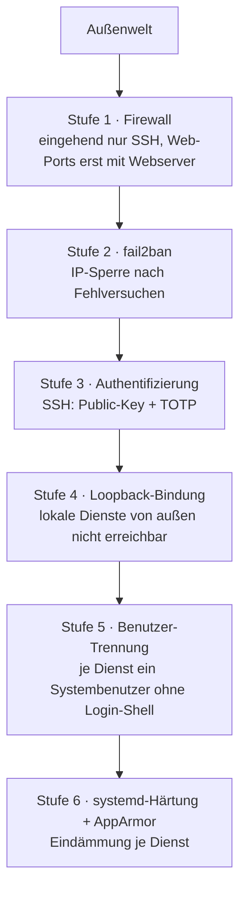

# Härtung

Dieses Dokument legt die Anforderungen an die Härtung des Linux Grundsystems fest und beschreibt deren Umsetzung. Es benennt Maßstab und Schutzziele, sowie die Härtungsmaßnahmen.

## Inhaltsverzeichnis

1 Maßstab und Geltung

2 Schutzziele und Defense-in-depth

3 Authentifizierung und Zwei-Faktor

4 Minimale Angriffsfläche

5 Brute-Force-Schutz

6 Trennung der Zugangsdaten

7 Dienst-Isolation

8 Härtungsprüfung

## 1. Maßstab und Geltung

Die Härtung folgt dem BSI-IT-Grundschutz als Referenz für die Auswahl der Maßnahmen. Die technische Konfiguration wird mit dem CIS-Benchmark für Ubuntu Server (Level 1) geprüft. CIS Level 1 liefert die konkrete, testbare Konfigurations-Checkliste.

Der Maßstab ist verbindlicher Soll-Maßstab, d. h. *bergündete* Abweichungen können möglich sein.

## 2. Schutzziele und Defense-in-depth

Ein sicher geschützter Zugriff besteht aus mehrere unabhängige Schichten. Das Schichtenmodell:

## 3. Authentifizierung und Zwei-Faktor

Interaktiver Login erfolgt nicht ohne zweiten Faktor. Für SSH ist das Public-Key plus TOTP über PAM (`pam_google_authenticator.so` aus `libpam-google-authenticator`). Passwort-Authentifizierung und Root-Login per SSH sind abgeschaltet. Der SSH Authentifizierungs Stack: `AuthenticationMethods publickey,keyboard-interactive`, `KbdInteractiveAuthentication yes` und `UsePAM yes`.

Administrative Tätigkeiten laufen über den Wechsel zum Root-Konto per `su`. `sudo` gehört zur Ubuntu-Standardinstallation und bleibt installiert, weil der CIS-Benchmark es erwartet, wird aber nicht genutzt. Der Hauptbenutzer ist kein Mitglied administrativer Gruppen (insbesondere nicht der Gruppe `sudo`). Änderungen an der sudo-Konfiguration werden durch `auditd` ünerwacht.

Der SSH-Zugang ist auf eine eigene Gruppe beschränkt (`AllowGroups ssh-users`). Die Konfiguration für den Login ist restriktiv (u. a. `PermitRootLogin no`, `PasswordAuthentication no`, `MaxAuthTries`, `LoginGraceTime`) und ggf. mit `sshd -T` überprüfbar.

Jeder SSH-Login löst eine Mail-Benachrichtigung an die Admin-Adresse aus. Die Benachrichtigung läuft über `pam_exec` in `/etc/pam.d/sshd` (Session-Zeile `optional`, Skript als `root` mit Mode 700), nicht über `sshrc` (`optional` sorgt dafür, dass ein Mail-Fehler den Login nicht blockiert). Sicherheitsrelevante Ereignisse werden persistent in `journald` protokolliert und mindestens drei Monate aufbewahrt.

## 4. Minimale Angriffsfläche

Eingehend ist im Grundzustand nur SSH offen. Die Web-Ports 80 und 443 öffnen erst mit dem aktiven Webserver, Port 80 nur temporär zur Zertifikatsausstellung. Alle Dienste laufen mit minimal möglichen  Rechten.

## 5. Brute-Force-Schutz

Wiederholte fehlgeschlagene Anmeldversuche lösen eine Sperre der Quell-IP durch `fail2ban`. Die Voreinstellungen genügen. Sie werden über eine `jail.local` gegen Überschreiben bei Updates geschützt, das `sshd`-Jail ist in der Standardkonfiguration aktiv.

## 6. Trennung der Zugangsdaten

Diese Stelle legt die maßgebliche Regel für Dateien mit Zugangsdaten fest.

Regel für Dateien mit Zugangsdaten:

- Eine Datei, die nur `root` liest, erhält Eigentümer `root:root` und Mode exakt 600.
- Eine Datei, die ein Dienst-Benutzer lesen muss, erhält Eigentümer `root:<dienst-gruppe>` und Mode exakt 640. Mode 640 ist nur in Verbindung mit einer dafür eingerichteten Gruppe zulässig.

## 7. Dienst-Isolation

Dienste, die keine root-Rechte benötigen (Postfix, nginx), laufen unter einem eigenen System-Benutzer ohne Login-Shell. Loopback-Bindung lokaler Dienste wird bevorzugt. Erreichbarkeit von außen nur begründeten Fällen (z. B. Webseerver).

Über die Benutzer-Trennung hinaus sieht der BSI-Grundschutz Mandatory-Access-Control (AppArmor) oder Isolation per Container/chroot für exponierte Dienste vor. Die Umsetzung ist zweistufig festgelegt:
- Stufe 1: jede selbst eingerichtete systemd-Unit erhält Hardening-Direktiven (`NoNewPrivileges`, `ProtectSystem=strict`, `PrivateTmp`, `ProtectHome`).
- Stufe 2: die von Ubuntu mitgelieferten AppArmor Profile laufen im Enforce-Modus und werden in einem Härtungs-Prüflauf kontrolliert. Wo keine AppArmor Profile mitgeliefert werden, werden einegen profile erstellt (Beispiel `nginx`).

## 8. Härtungsprüfung

Die Härtungsprüfung erfolgt mit `lynis` (`lynis audit system`) als Standard-Audit-Werkzeug, ergänzt um den Abgleich mit der CIS-Konfigurations-Checkliste (Ubuntu Server Level 1). Der Lauf wird zeitbasiert automatisiert (cron) und sein Ergebnis abgelegt.

Der Befund je BSI-Maßnahmenklasse wird mit Schweregrad und Handlungsempfehlung festgehalten. Der Prüflauf erfolgt monatlich.

Ein Schutzvor Schadsoftware wird von `rkhunter`, mit täglichem Lauf aus `cron.daily` und Mail-Bericht an die Admin-Adresse, geleistet. Die Baseline-Datenbank wird bei der Einrichtung initialisiert (`rkhunter --propupd`). Das Monitoring prüft die Aktualität des Scan-Logs.

## Versionshistorie

| Version | Datum | Wer | Änderung |
|---|---|---|---|
| 0.01 | 2026-06-18 | macodix | Erstanlage |
