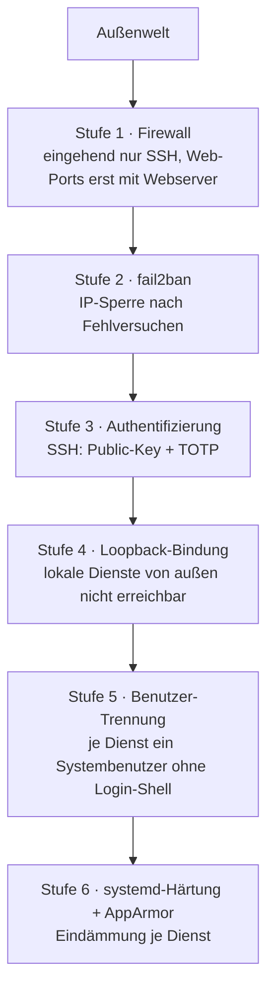

# Härtung

Dieses Dokument legt die Anforderungen an die Härtung des Linux Grundsystems fest und beschreibt deren Umsetzung. Es benennt Maßstab und Schutzziele, sowie die Härtungsmaßnahmen.

## Inhaltsverzeichnis

1. Maßstab und Geltung
2. Schutzziele und Defense-in-depth
3. Authentifizierung und Zwei-Faktor
4. Minimale Angriffsfläche
5. Brute-Force-Schutz
6. Trennung der Zugangsdaten
7. Dienst-Isolation
8. Härtungsprüfung

## 1. Maßstab und Geltung

Die Härtung folgt dem BSI-Grundschutz als Referenz für die Auswahl der Maßnahmen. Die technische Konfiguration wird mit dem CIS-Benchmark (Level 1) geprüft. CIS Level 1 liefert die konkrete, testbare Konfigurations-Checkliste.

Der Benchmark ist distributionsspezifisch: Maßgeblich ist der Benchmark der eingesetzten Distribution — der *CIS Ubuntu Linux Benchmark* auf Ubuntu, der *CIS Debian Linux Benchmark* auf Debian. Liegt für den eingesetzten Stand noch kein Benchmark vor, gilt der des jüngsten veröffentlichten Stands derselben Distribution. Die Auswahl der Maßnahmen ändert das nicht — sie folgt dem BSI-Grundschutz und ist für beide Distributionen dieselbe.

Der Maßstab ist verbindlicher Soll-Maßstab, d. h. *begründete* Abweichungen können möglich sein.

## 2. Schutzziele und Defense-in-depth

Ein sicher geschützter Zugriff besteht aus mehrere unabhängige Schichten. Das Schichtenmodell:

## 3. Authentifizierung und Zwei-Faktor

Interaktiver Login erfolgt nicht ohne zweiten Faktor. Für SSH ist das Public-Key plus TOTP über PAM (`pam_google_authenticator.so` aus `libpam-google-authenticator`). Passwort-Authentifizierung und Root-Login per SSH sind abgeschaltet. Der SSH Authentifizierungs Stack: `AuthenticationMethods publickey,keyboard-interactive`, `KbdInteractiveAuthentication yes` und `UsePAM yes`.

Administrative Tätigkeiten laufen über den Wechsel zum Root-Konto per `su`. `sudo` wird nicht genutzt. Gehört es zur Standardinstallation der Distribution, bleibt es installiert — der CIS-Benchmark erwartet es. Nachinstalliert wird es nicht. Der Hauptbenutzer ist kein Mitglied administrativer Gruppen (insbesondere nicht der Gruppe `sudo`). Ist `sudo` vorhanden, überwacht `auditd` Änderungen an seiner Konfiguration.

Der SSH-Zugang ist auf eine eigene Gruppe beschränkt (`AllowGroups ssh-users`). Die Konfiguration für den Login ist restriktiv (`PermitRootLogin no`, `PasswordAuthentication no`, `PermitEmptyPasswords no`, `MaxAuthTries 3`, `LoginGraceTime 60`, `ClientAliveInterval 300`, `ClientAliveCountMax 0`) und mit `sshd -T` überprüfbar.

Jeder SSH-Login löst eine Mail-Benachrichtigung an die Administrator Email Adresse aus. Die Benachrichtigung läuft über `pam_exec` in `/etc/pam.d/sshd` (Session-Zeile `optional`, Skript als `root` mit Mode 700), nicht über `sshrc` (`optional` sorgt dafür, dass ein Mail-Fehler den Login nicht blockiert). Sicherheitsrelevante Ereignisse werden persistent in `journald` protokolliert und mindestens drei Monate aufbewahrt.

## 4. Minimale Angriffsfläche

Eingehend ist im Grundzustand nur SSH offen. Die Web-Ports 80 und 443 öffnen erst mit dem aktiven Webserver, Port 80 nur temporär zur Zertifikatsausstellung. Alle Dienste laufen mit minimal möglichen  Rechten.

Über die Netz- und Rechte-Ebene hinaus härtet das `base`-Modul den Kernel per `sysctl` (vollständiges ASLR `kernel.randomize_va_space=2`, verborgene Kernel-Pointer `kernel.kptr_restrict=2`, `kernel.dmesg_restrict=1`, eingeschränktes `ptrace` über `kernel.yama.ptrace_scope=1`). Ungenutzte Schnittstellen werden gesperrt: das Kernel-Modul `usb-storage` ist per modprobe-Blacklist deaktiviert, `autofs` ist maskiert. Die Systemzeit wird über NTP synchronisiert (`timedatectl set-ntp true`) — Voraussetzung für verlässliche Protokoll-Zeitstempel und gültige TLS-Verbindungen.

## 5. Brute-Force-Schutz

Wiederholte fehlgeschlagene Anmeldversuche lösen eine Sperre der Quell-IP durch `fail2ban`. Die Voreinstellungen genügen. Sie werden über eine `jail.local` gegen Überschreiben bei Updates geschützt, das `sshd`-Jail ist in der Standardkonfiguration aktiv.

## 6. Trennung der Zugangsdaten

Diese Stelle legt die maßgebliche Regel für Dateien mit Zugangsdaten fest.

Regel für Dateien mit Zugangsdaten:

- Eine Datei, die nur `root` liest, erhält Eigentümer `root:root` und Mode exakt 600.
- Eine Datei, die ein Dienst-Benutzer lesen muss, erhält Eigentümer `root:<dienst-gruppe>` und Mode exakt 640. Mode 640 ist nur in Verbindung mit einer dafür eingerichteten Gruppe zulässig.

## 7. Dienst-Isolation

Dienste, die keine root-Rechte benötigen (Postfix, nginx), laufen unter einem eigenen System-Benutzer ohne Login-Shell. Loopback-Bindung lokaler Dienste wird bevorzugt. Erreichbarkeit von außen nur begründeten Fällen (z. B. Webseerver).

Über die Benutzer-Trennung hinaus sieht der BSI-Grundschutz Mandatory-Access-Control (AppArmor) oder Isolation per Container/chroot für exponierte Dienste vor. Die Umsetzung ist zweistufig festgelegt:
- Stufe 1: jede selbst eingerichtete systemd-Unit erhält Hardening-Direktiven (`NoNewPrivileges`, `ProtectSystem=strict`, `PrivateTmp`, `ProtectHome`).
- Stufe 2: das `base`-Modul installiert `apparmor` und `apparmor-utils` und stellt den aktiven Dienst sicher; die von Ubuntu mitgelieferten AppArmor-Profile laufen im Enforce-Modus und werden in einem Härtungs-Prüflauf kontrolliert. Wo keine Profile mitgeliefert werden, werden eigene erstellt (Beispiel `nginx`).

## 8. Härtungsprüfung

Die Härtungsprüfung erfolgt mit `lynis` (`lynis audit system`) als Standard-Audit-Werkzeug, ergänzt um den Abgleich mit der CIS-Konfigurations-Checkliste (Level 1) der eingesetzten Distribution (Kapitel 1). `lynis` erkennt die Distribution selbst und braucht dafür keine Vorgabe. Der Lauf wird zeitbasiert automatisiert (cron) und sein Ergebnis abgelegt.

Der Befund je BSI-Maßnahmenklasse wird mit Schweregrad und Handlungsempfehlung festgehalten. Der Prüflauf erfolgt monatlich.

Ein Schutz vor Schadsoftware wird von `rkhunter`, mit täglichem Lauf aus `cron.daily` und Mail-Bericht an die Administrator Email Adresse, geleistet. Die Baseline-Datenbank wird bei der Einrichtung initialisiert (`rkhunter --propupd`). Das Monitoring prüft die Aktualität des Scan-Logs.

Dateien, die der Normalbetrieb erzeugt und `rkhunter` als verdächtig meldet, sind in `/etc/rkhunter.conf` als Ausnahmen eingetragen: die von systemd unter `/etc` angelegten versteckten Dateien und die Shared-Memory-Segmente des PostgreSQL-Servers unter `/dev/shm`. Der Verzicht auf diese Ausnahmen wäre kein Sicherheitsgewinn, im Gegenteil: Ein Bericht, der bei jedem Lauf dieselben Fehlalarme enthält, wird nicht mehr gelesen und verdeckt echte Funde.

## Versionshistorie

| Version | Datum | Wer | Änderung |
|---|---|---|---|
| 0.01 | 2026-06-18 | macodix | Erstanlage |
| 0.02 | 2026-06-22 | macodix | base-Grundhärtung (sysctl, usb-Blacklist, autofs, NTP) und konkrete sshd-Sollwerte ergänzt; AppArmor-Aktivierung durch base benannt. |
| 0.03 | 2026-07-13 | macodix | Aussage zu sudo distributionsneutral gefasst: nicht genutzt, nicht nachinstalliert, Überwachung nur wenn vorhanden. |
| 0.04 | 2026-07-13 | macodix | Härtungsmaßstab: CIS-Benchmark der eingesetzten Distribution (Ubuntu bzw. Debian) statt fest Ubuntu. |
